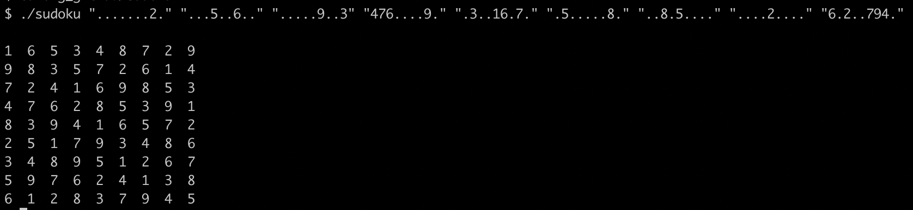

# sudoku_solver
sudoku_solver is a program, that solves any valid [sudoku board](https://en.wikipedia.org/wiki/Sudoku) using recursive backtracking.

## Usage
Download and compile repo:
```
git clone https://github.com/khodizoda/sudoku_solver
cd sudoku_solver
make
```

Execute with:
```
./sudoku line0 line1 line2 line3 line4 line5 line6 line7 line8
```
where lineN represents a characters string of values ranged between ’1’ to ’9’ or ’ . ’ (for empty boxes).

## Example
```
./sudoku ".......2." "...5..6.." ".....9..3" "476....9." ".3..16.7." ".5.....8." "..8.5...." "....2...."
"6.2..794."
```

